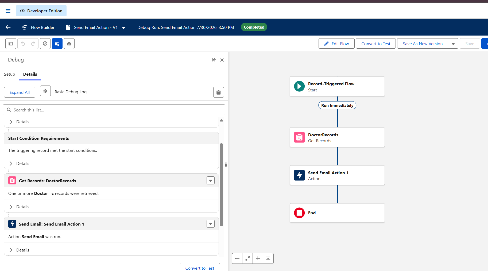
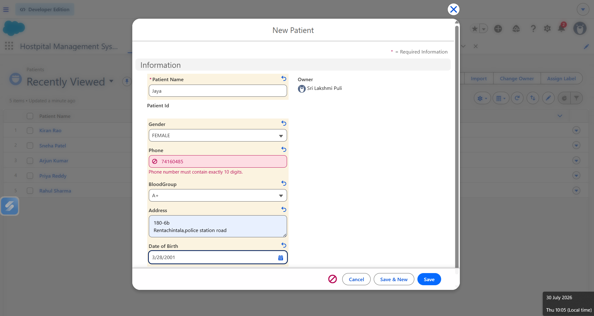
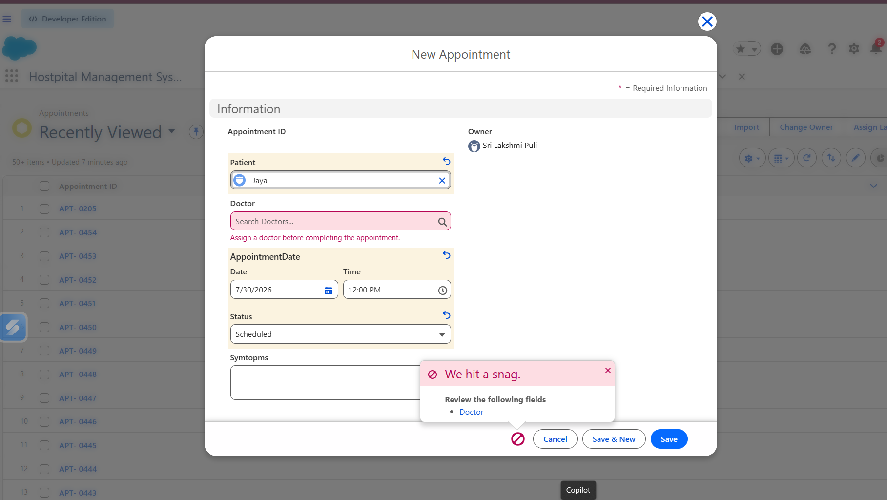
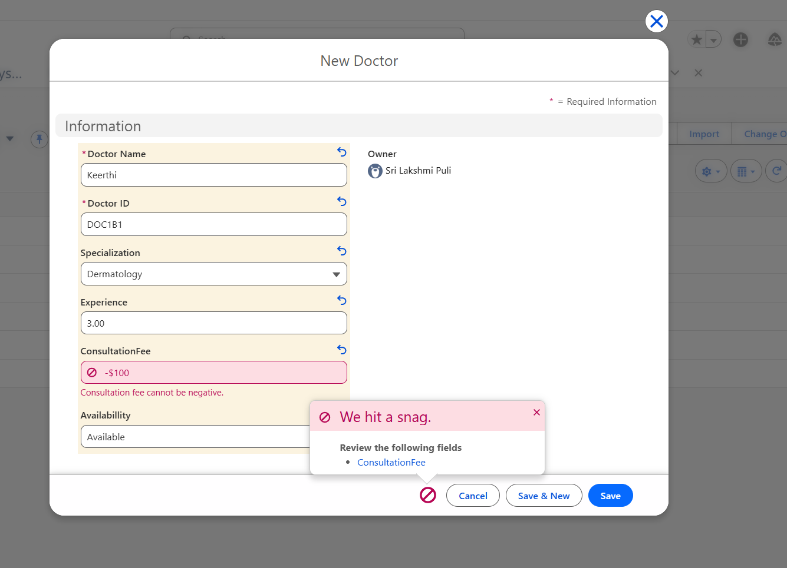

# 🏥 Hospital OPD Management System
### Salesforce Developer Bridge Program – Day 3
### Topic: Validation Rules, Record-Triggered Flow & Automation

---

## 📌 Project Overview

The Hospital OPD Management System is a Salesforce application developed to manage patients, doctors, and appointments. The objective of today's task was to implement declarative automation using Validation Rules and Record-Triggered Flows by following Salesforce's **Clicks Before Code** approach.

---

# 🎯 Business Requirement

**Requirement 1**

Whenever a patient books an appointment, send an email notification to the assigned doctor.

---

## 🛠 Automation Implemented

### 1. Record-Triggered Flow

**Flow Name**

```
Send Email Action - V1
```

**Flow Type**

```
Record-Triggered Flow
```

**Object**

```
Appointment__c
```

**Trigger**

```
When a record is created
```

<p align="center">
  
</p>
```

### Flow Description

- Triggered whenever a new Appointment record is created.
- Retrieves the related Doctor record.
- Reads the Doctor Email.
- Sends an email notification to the doctor.

---

# ✅ Validation Rules Implemented

## Validation Rule 1

**Object:** Patient__c

**Purpose**

Patient phone number must contain exactly 10 digits.

**Formula**

```text
OR(
ISBLANK(Phone__c),
LEN(Phone__c) <> 10,
NOT(ISNUMBER(Phone__c))
)
```
<p align="center">
  
</p>
---

## Validation Rule 2

**Object:** Appointment__c

**Purpose**

Assign a doctor before completing the appointment.

**Formula**

```text
AND( ISPICKVAL(Status__c,'Scheduled'),
ISBLANK(Doctor__c)
)
```
<p align="center">
  
</p>
---

## Validation Rule 3

**Object:** Doctor__c

**Purpose**

Consultation fee cannot be negative.

**Formula**

```text
Consultation_Fee__c < 0
```
<p align="center">
  
</p>
---

# 🧪 Testing

| Test Case | Expected Result | Status |
|------------|-----------------|--------|
| Create Appointment | Flow should execute | ✅ Passed |
| Get Doctor Record | Doctor record retrieved | ✅ Passed |
| Send Email Action | Email action executed | ✅ Passed |
| Flow Debug | Flow Interview Finished Successfully | ✅ Passed |
| Email Delivery | Under verification due to Developer Edition email configuration | ⚠️ |

---


# 📚 Learning Outcomes

- Learned the difference between Validation Rules, Flow, and Apex Trigger.
- Built a Record-Triggered Flow.
- Used Get Records element.
- Used Send Email action.
- Tested Flow execution using Debug.
- Understood Salesforce declarative automation.

---

# ❓ README Questions

## 1. Which requirements did you solve using Flow?

- Sent an email notification to the assigned doctor when an Appointment record was created.
- Retrieved the related Doctor record using Get Records.
- Automated the business process without writing Apex code.

---

## 2. Which requirements required Validation Rules?

- Patient phone number must contain exactly 10 digits.
- Appointment date cannot be in the past.
- Consultation fee cannot be negative.

---

## 3. Which requirements still needed Apex?

The implemented requirements did not require Apex because they were achievable using declarative tools.

Examples where Apex would be required:

- Integration with external hospital systems
- Complex appointment scheduling logic
- SMS notifications
- Bulk record processing
- Advanced business calculations

---

## 4. Why did you choose those solutions?

I followed Salesforce's **Clicks Before Code** principle.

- Validation Rules were used to maintain data quality by preventing invalid records.
- Record-Triggered Flow was used for automation because it is declarative, easy to maintain, and recommended by Salesforce.
- Apex was not used because the current requirements could be implemented using standard Salesforce automation features.

---

# 🚀 Technologies Used

- Salesforce Developer Edition
- Flow Builder
- Validation Rules
- Custom Objects
- Lookup Relationships
- CRM

---

# 📂 Objects Used

- Patient__c
- Doctor__c
- Appointment__c

---

# 📌 Conclusion

Successfully implemented declarative automation for the Hospital OPD Management System using Validation Rules and Record-Triggered Flow. The Flow executed successfully during testing, and the automation followed Salesforce best practices by using declarative tools instead of Apex wherever possible.
