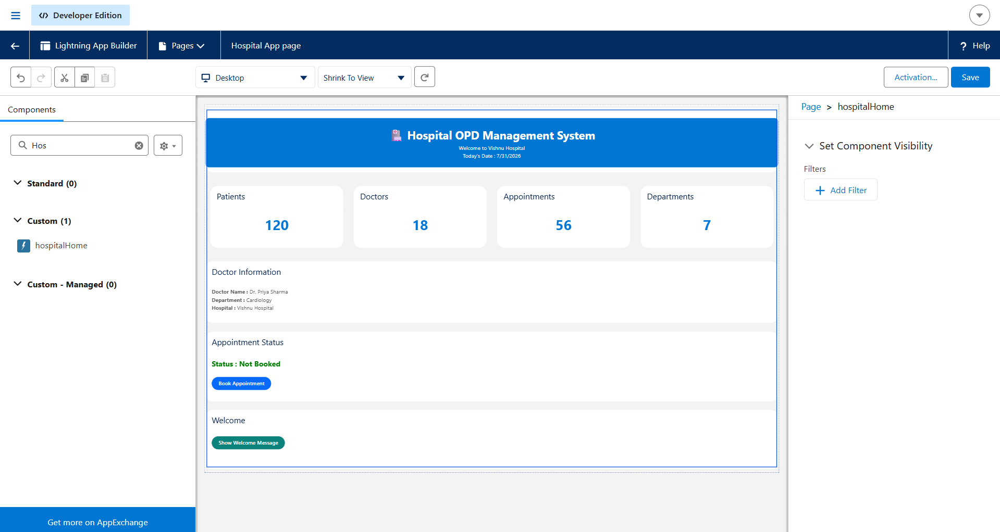

# 🏥 Day 4 – Lightning Web Components (LWC)

## 📌 Project
**Hospital OPD Management System**

This project demonstrates the creation of a **Lightning Web Component (LWC)** that serves as the home dashboard for the Hospital OPD Management System. The component provides a modern, responsive interface for accessing various hospital management modules.

---

# 📖 What is LWC?

**Lightning Web Components (LWC)** is Salesforce's modern UI framework for building fast, reusable, and efficient web components. It is based on standard web technologies such as **HTML, JavaScript, CSS, and Web Components**. LWC enables developers to create dynamic user interfaces that seamlessly integrate with Salesforce using Apex and Lightning Data Service.

---

# 🎯 What Did I Build?

I developed the **Hospital Home Dashboard** for the Hospital OPD Management System.

The dashboard serves as the application's landing page and provides quick access to major hospital modules, including:

- 👨‍⚕️ Patient Management
- 🩺 Doctor Management
- 📅 Appointment Management
- 📋 Medical Records
- 💳 Billing
- 💊 Pharmacy

The interface is built using the **Salesforce Lightning Design System (SLDS)** to ensure a clean, responsive, and user-friendly experience.

---


---

# 📄 Files Included

| File | Description |
|------|-------------|
| `hospitalHome.html` | Defines the user interface and page layout |
| `hospitalHome.js` | Contains JavaScript logic and event handling |
| `hospitalHome.css` | Applies custom styling to the component |
| `hospitalHome.js-meta.xml` | Configures component visibility and deployment |

---

# 📁 Source Code

The complete source code for the Hospital Home Lightning Web Component is available in the `SourceCode` folder.


## 8️⃣ Hospital Home Dashboard

The Hospital Dashboard displaying all management modules.



---

## 9️⃣ Final Output

Final user interface displayed within Salesforce.


---

# ❓ README Questions

## 1. What is LWC?

Lightning Web Components (LWC) is Salesforce's modern framework for building reusable and high-performance user interfaces using HTML, JavaScript, and CSS.

---

## 2. What did you build?

I built the **Hospital Home Dashboard**, which serves as the landing page for the Hospital OPD Management System. It provides quick access to different hospital modules through an intuitive interface.

---

## 3. Which file contains HTML?

The HTML markup is located in:

```text
hospitalHome.html
```

It defines the structure and layout of the user interface.

---

## 4. Which file contains JavaScript?

The JavaScript code is located in:

```text
hospitalHome.js
```

It manages the component's behavior, variables, and event handling.

---

## 5. What did you learn today?

Through this exercise, I learned:

- Lightning Web Components (LWC) architecture
- LWC folder structure
- Creating components using VS Code
- HTML, JavaScript, CSS, and Meta XML in LWC
- Deploying components to Salesforce
- Using Lightning App Builder
- Building responsive interfaces with SLDS
- Organizing reusable UI components for Salesforce applications

---

# 🛠️ Technologies Used

- Salesforce Platform
- Lightning Web Components (LWC)
- HTML
- JavaScript
- CSS
- Salesforce Lightning Design System (SLDS)
- Visual Studio Code
- Salesforce CLI

---

# 🎯 Outcome

Successfully designed, developed, and deployed the **Hospital Home Dashboard** using Lightning Web Components. This dashboard serves as the foundation for future Hospital OPD Management System modules such as Patient Management, Doctor Management, Appointment Scheduling, Billing, Pharmacy, and Medical Records.
