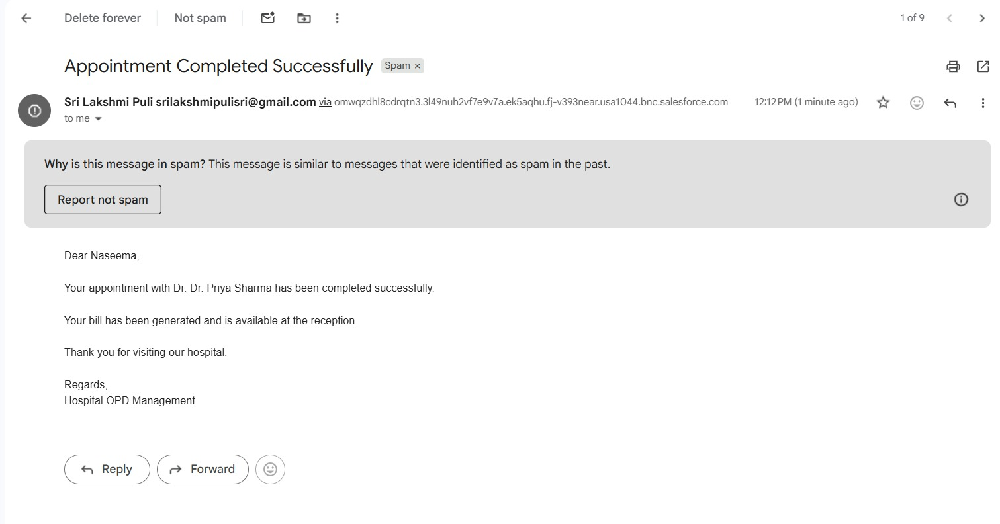
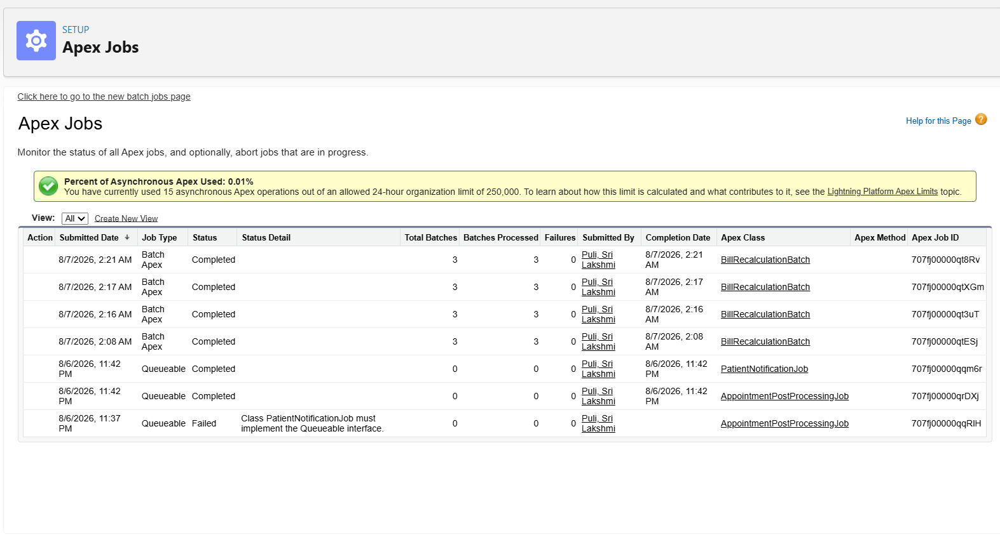

# 🚀 Sprint 8 – Asynchronous Apex

Sprint 8 focuses on implementing Salesforce Asynchronous Apex to execute time-consuming and resource-intensive operations in the background. By separating immediate business logic from secondary processing, the application provides a faster user experience while remaining scalable and compliant with Salesforce Governor Limits.

---

## ⚡ What is Asynchronous Apex?

Asynchronous Apex allows Apex code to execute independently of the current user transaction. Instead of making users wait for long-running operations to complete, Salesforce processes these tasks in the background. This approach improves application performance, supports large-scale data processing, and enables reliable execution of scheduled or dependent business operations.

---

## 🔹 Future Methods

Future Methods are Salesforce's legacy asynchronous processing mechanism used for simple background operations. They execute static methods asynchronously and are suitable for lightweight tasks such as sending emails or making simple callouts. Due to their limitations, modern Salesforce applications generally prefer Queueable Apex.

**Key Features**
- Executes methods asynchronously
- Supports lightweight background processing
- Requires static methods
- Accepts only primitive data types
- Cannot chain additional asynchronous jobs

---

## 🔹 Queueable Apex

Queueable Apex provides a flexible and powerful way to execute business processes asynchronously. It supports complex data types, constructors, job monitoring, and Queueable Chaining, making it the recommended approach for modern Salesforce development.

**Implemented Features**
- Background processing using `System.enqueueJob()`
- Post-appointment asynchronous processing
- Queueable Chaining
- Modular service-based architecture
- Background email notifications
- Automatic bill generation
- Hospital statistics update

---


## 📸 Queueable Email Notification

After an appointment is successfully completed, the application triggers a Queueable Apex job that performs background processing. Once the bill is generated and hospital statistics are updated, a chained Queueable job sends an appointment completion email to the patient.

**Email Notification Preview**

<p align="center">
  
</p>

**Highlights**
- Triggered asynchronously using Queueable Apex
- Executed after successful appointment completion
- Demonstrates Queueable Chaining
- Sent using Salesforce Email Services
- Confirms successful completion of the patient's appointment

---
## 🔹 Batch Apex

Batch Apex is designed to process large volumes of Salesforce records efficiently by dividing them into smaller batches. Each batch executes as an independent transaction with fresh Governor Limits, making it suitable for large-scale maintenance and historical data processing.

**Implemented Features**
- Historical bill recalculation
- Batch processing of records
- Bulk-safe data updates
- Optimized large data volume handling

**Batch Lifecycle**
- `start()`
- `execute()`
- `finish()`


### 🔹 Batch Apex – Apex Jobs

The historical bill recalculation is executed using **Batch Apex**. Salesforce processes the records in multiple batches, and the execution status can be monitored from **Setup → Apex Jobs**.

<p align="center">
  
</p>

---


## 🔹 Scheduled Apex

Scheduled Apex allows Apex classes to execute automatically at predefined dates and times using CRON expressions. It is commonly used to automate recurring business processes such as daily maintenance, report generation, data cleanup, and periodic batch execution.

**Key Features**
- Automates recurring tasks
- Uses CRON expressions for scheduling
- Can execute Batch Apex or Queueable Apex jobs
- Eliminates the need for manual execution
---
## 🏗️ Asynchronous Workflow

```text
Appointment Completed
        │
        ▼
AppointmentService
        │
        ▼
System.enqueueJob()
        │
        ▼
AppointmentPostProcessingJob
        │
        ├── Generate Bill
        ├── Update Hospital Statistics
        │
        ▼
System.enqueueJob()
        │
        ▼
PatientNotificationJob
        │
        ▼
NotificationService
        │
        ▼
Patient Email Notification
```

---

## 🎯 Learning Outcomes

- Understood the purpose and benefits of Asynchronous Apex.
- Learned the differences between Future Methods, Queueable Apex, and Batch Apex.
- Implemented scalable background processing using Queueable Apex.
- Designed Queueable Chaining for sequential execution of dependent tasks.
- Processed historical data efficiently using Batch Apex.
- Applied Salesforce best practices for building maintainable, bulk-safe, and scalable asynchronous solutions.
