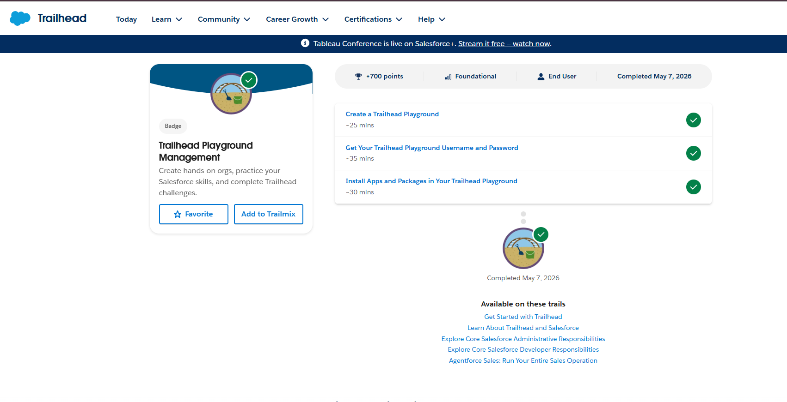
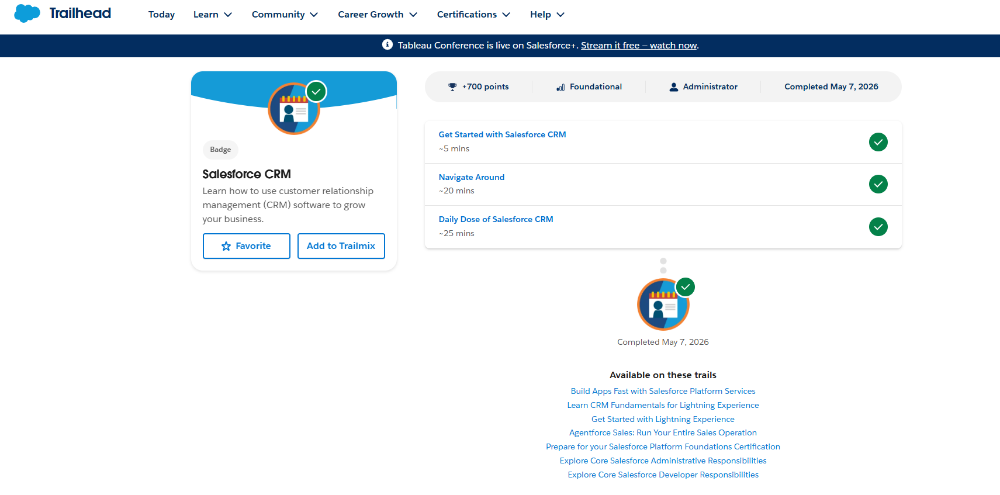
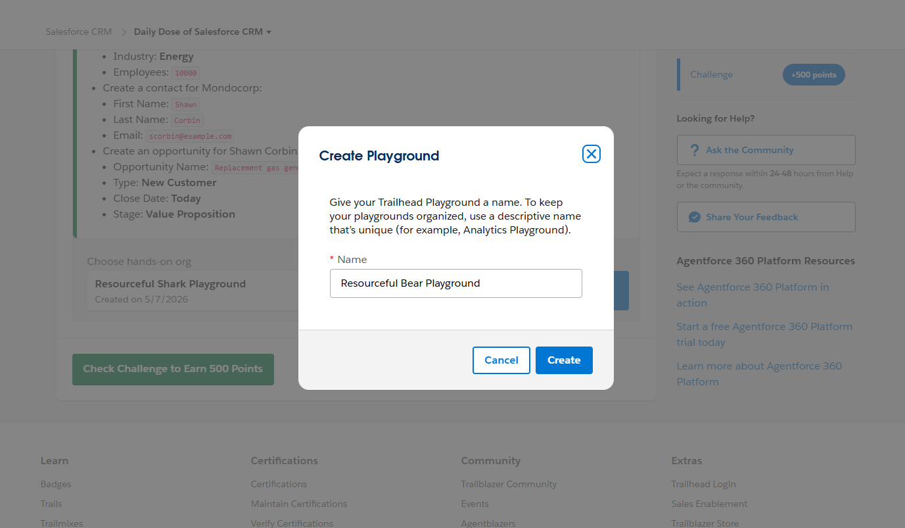

# Day 1 - CRM Basics

## What is CRM

CRM stands for Customer Relationship Management.  
It is a system used by companies to manage customer data, communication, sales, and services in one place.

CRM helps businesses:
- Store customer information
- Track sales and leads
- Improve communication
- Manage customer relationships
- Increase business efficiency

---

## Why Companies Use Salesforce

Salesforce is a cloud-based CRM platform used by companies to manage business processes.

Companies use Salesforce to:
- Manage customers and sales
- Track opportunities and leads
- Automate workflows
- Store data securely
- Improve customer support
- Access data from anywhere

---

## Salesforce Objects

### Account
An Account represents an organization, company, or institution.

Example:
- Hospital
- College
- Company

### Contact
A Contact is a person associated with an account.

Example:
- Patient
- Student
- Employee

### Opportunity
An Opportunity represents a possible business deal or process.

Example:
- Treatment process
- Admission process
- Sales deal

---

## Business Workflow

Lead → Contact → Opportunity → Customer

A Lead is a person who shows interest in a service or product.  
When the company contacts and verifies the person, they become a Contact.  
If there is a possible business deal or process, it becomes an Opportunity.  
When the process is completed successfully, the person becomes a Customer.

---

## Real-World Mapping - Hospital Management

| Salesforce Term | Hospital Example |
|---|---|
| Account | Hospital |
| Contact | Patient |
| Lead | Patient inquiry or appointment request |
| Opportunity | Treatment or admission process |

---

## Screenshots

### Trailhead Module Completion

### Salesforce Playground

### App Launcher

### CRM Module Completion

### Playground Setup

