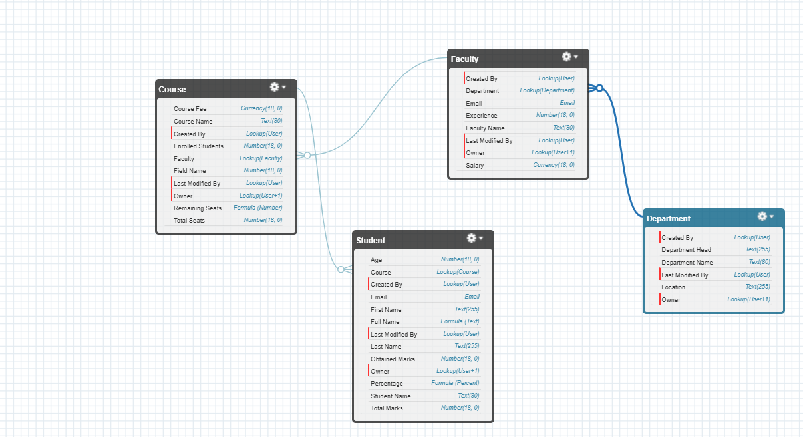
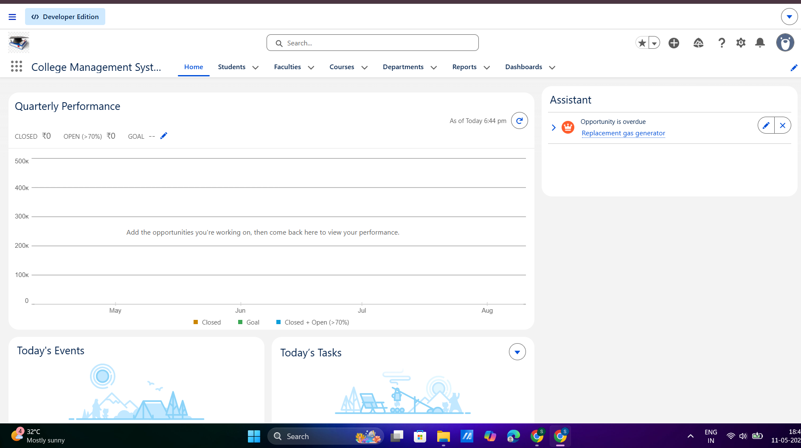

# Day 3 - Data Modeling in Salesforce

# 1. Difference Between App, Object, Record, and Field

| Term | Description |
|------|-------------|
| App | A collection of tabs, objects, and features grouped together for users. Example: College Management App |
| Object | A database table that stores data. Example: Student, Faculty, Course |
| Record | A single entry inside an object. Example: One student’s details |
| Field | A single piece of information inside a record. Example: Student Name, Email, Age |

---

# 2. Standard vs Custom Objects

## Standard Objects
Standard objects are already provided by Salesforce.

Examples:
- Account
- Contact
- Opportunity
- Lead

These are commonly used CRM objects.

## Custom Objects
Custom objects are created by users based on business requirements.

Examples:
- Student
- Faculty
- Course
- Department

Custom objects help companies build their own systems.

---

# 3. College Data Model

## Objects
- Student
- Faculty
- Course
- Department

## Relationships

### Department → Faculty
One department can have many faculty members.

### Faculty → Course
One faculty member can teach many courses.

### Course → Student
One course can contain many students.

## Relationship Type
Lookup Relationships are used between objects.

---

# Data Model Diagram

```text
Department
   ↓
Faculty
   ↓
Course
   ↓
Student
```

## Schema Builder Screenshot



---

# 4. Formula Fields

## 1. Full Name

### Formula
```salesforce
First_Name__c & " " & Last_Name__c
```

### Explanation
Automatically combines first name and last name to avoid manual typing errors.

---

## 2. Remaining Seats

### Formula
```salesforce
Total_Seats__c - Enrolled_Students__c
```

### Explanation
Automatically shows available seats in a course and prevents manual calculations.

---

## 3. Percentage

### Formula
```salesforce
(Obtained_Marks__c / Total_Marks__c) * 100
```

### Explanation
Automatically calculates student percentage accurately and saves time.

---

# 5. Validation Rules

## 1. Student Age Cannot Be Negative

### Formula
```salesforce
Age__c < 0
```

### Error Message
Age cannot be negative.

### Explanation
Prevents invalid age values from being stored.

---

## 2. Email Cannot Be Empty

### Formula
```salesforce
ISBLANK(Email__c)
```

### Error Message
Email is required.

### Explanation
Ensures every student has contact information.

---

## 3. Enrolled Students Cannot Exceed Total Seats

### Formula
```salesforce
Enrolled_Students__c > Total_Seats__c
```

### Error Message
Enrolled students cannot exceed total seats.

### Explanation
Prevents over-enrollment in courses.

---

# 6. Lightning App

## College Management System App



---

# 7. Reflection: Why Structured Enterprise Data Matters

Structured enterprise data helps organizations store information in a clean, organized, and reliable way. Unlike random spreadsheets, structured systems reduce duplication, improve accuracy, and make reporting easier. Salesforce connects related data using objects and relationships, which helps companies automate processes and make better decisions. Structured data also improves teamwork because everyone accesses the same updated information from a single system.
