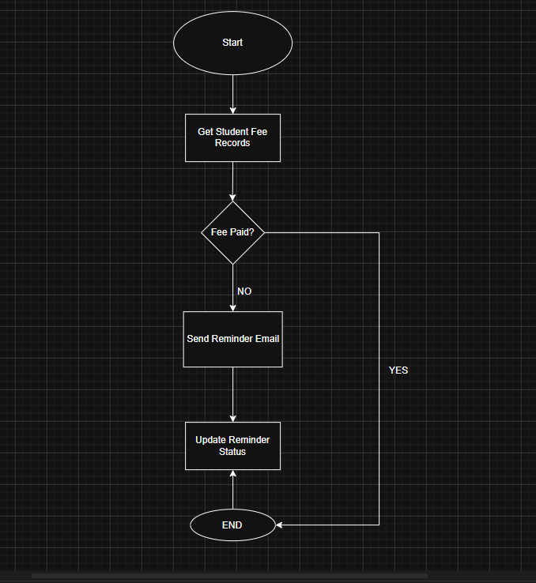

# Day 4 – Salesforce Flow Builder

## 📌 Overview

This project demonstrates the fundamentals of Flow Builder in Salesforce and how business processes can be automated using declarative tools. The project is based on a College Management System use case and focuses on improving efficiency through automation.

---

# 🚀 What is Flow Builder?

Flow Builder in Salesforce is a declarative automation tool that helps users automate business processes without writing code. It allows organizations to create workflows, collect user input, update records, send notifications, and automate repetitive tasks efficiently.

Flow Builder improves productivity, reduces manual work, and increases operational efficiency in enterprise systems.

---

# 🔄 Types of Flows in Salesforce

## 1. Screen Flow

A Screen Flow is an interactive flow that allows users to enter data and perform actions through screens.

### ✅ Features
- User interaction
- Input forms
- Navigation buttons
- Dynamic screens

### ✅ Use Cases
- Student registration
- Course enrollment
- Fee payment forms
- Feedback collection

---

## 2. Record Triggered Flow

A Record Triggered Flow runs automatically when a record is created, updated, or deleted in Salesforce.

### ✅ Features
- Fully automated
- Runs in background
- Real-time processing
- No user interaction required

### ✅ Use Cases
- Send confirmation emails
- Update remaining seats automatically
- Generate student IDs
- Notify faculty members

---

# 🏫 Automation Ideas for College Management System

## 1. Auto Email After Student Registration
Automatically send confirmation emails after successful registration.

## 2. Auto Update Remaining Seats
Automatically reduce available seats when students enroll in courses.

## 3. Notify Faculty When Course is Full
Send notifications to faculty members when course capacity reaches its limit.

## 4. Generate Student ID Automatically
Automatically generate unique IDs for newly registered students.

## 5. Send Fee Reminder Notifications
Automatically send reminders before the fee payment deadline.

---

# 📊 Flow Diagram – Fee Reminder Automation


```markdown

```

---

# ⚙️ Manual vs Automated Process

## Process Chosen: Student Fee Reminder System

### 🔴 Manual Process
- Staff manually checks fee records.
- Reminder emails are sent manually.
- Reminder status is updated manually.

### ❌ Problems in Manual Process
- Time consuming
- Human errors
- Delayed communication
- Difficult to manage large student data

---

## 🟢 Automated Process Using Salesforce

Using Salesforce Flow Builder:
- Pending fee records are checked automatically.
- Reminder emails are sent automatically.
- Records update automatically.

### ✅ Benefits of Automation
- Saves time
- Improves accuracy
- Reduces manual effort
- Faster communication
- Improves productivity

---

# 💡 Reflection – Why Automation Matters in Enterprise Systems

Automation is important in enterprise systems because it reduces repetitive manual tasks and improves operational efficiency. It helps organizations save time, reduce errors, improve customer experience, and increase productivity.

Using Salesforce automation, businesses can streamline workflows, improve communication, and allow employees to focus on strategic tasks instead of repetitive work.

Automation also helps organizations scale efficiently as business operations grow.

---

# 🛠️ Technologies Used

- Salesforce Flow Builder
- Salesforce CRM Platform

---

# 📚 Learning Outcomes

By completing this project, I learned:
- Basics of Salesforce Flow Builder
- Difference between Screen Flow and Record Triggered Flow
- Business process automation concepts
- Flow design thinking
- Enterprise workflow optimization
- Real-world automation use cases

---

# 👨‍💻 Author

Developed as part of Salesforce Flow Builder learning and automation practice.
